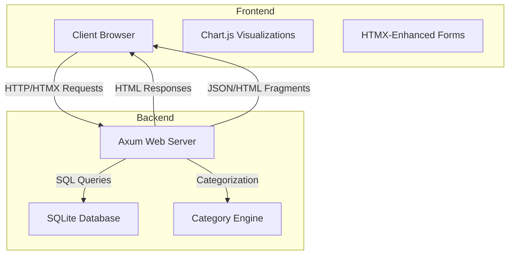
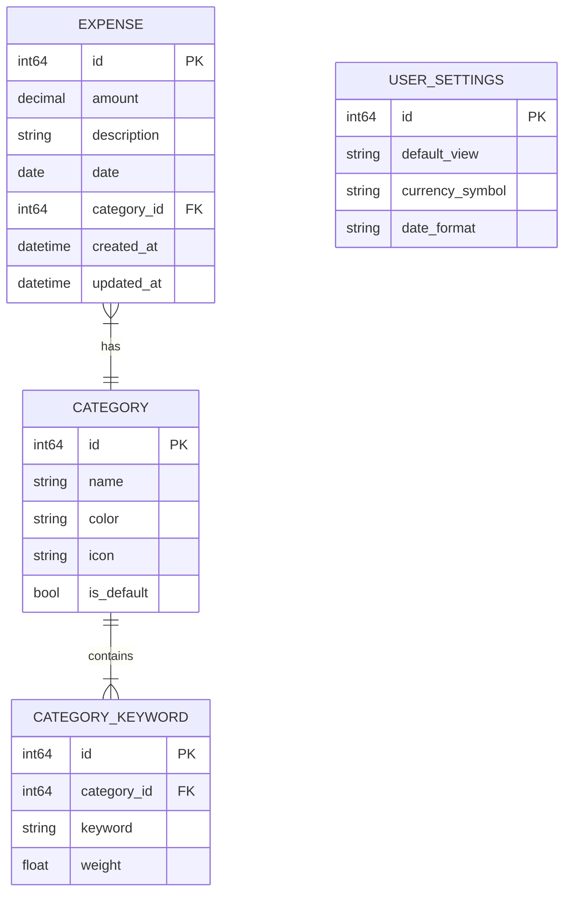

# Design Document: Budsjettis Expense Tracker

## Overview

Budsjettis is a personal finance tracking application that enables users to monitor their spending habits through manual expense entry and automatic categorization. The application provides real-time visualization of spending patterns through charts and graphs, helping users make informed financial decisions.

This design document outlines the technical approach, architecture, data models, and component structure for implementing the Budsjettis expense tracker based on the requirements specified.

## Architecture

The application follows a modern web architecture with clear separation of concerns:

### High-Level Architecture



### Key Components

1. **Frontend Layer**
   - HTML templates with HTMX for dynamic interactions
   - Chart.js for data visualization
   - Minimal custom JavaScript for enhanced interactions
   - CSS with responsive design principles

2. **Backend Layer**
   - Axum web framework for handling HTTP requests
   - Route handlers for different application features
   - Template rendering for HTML responses
   - JSON API endpoints for HTMX interactions

3. **Data Layer**
   - SQLite database for data persistence
   - SQLx for type-safe database interactions
   - Migration system for schema evolution

4. **Business Logic Layer**
   - Expense management
   - Category suggestion engine
   - Data aggregation for visualizations

## Components and Interfaces

### Frontend Components

1. **Layout Component**
   - Responsive container layout
   - Navigation menu
   - Mobile-optimized views

2. **Expense Form Component**
   - Input fields for amount, description, date, category
   - Real-time validation
   - Category suggestion display
   - Submission handling with HTMX

3. **Expense List Component**
   - Paginated list of expenses
   - Sorting and filtering options
   - Inline editing capabilities
   - Delete confirmation

4. **Dashboard Component**
   - Summary statistics
   - Category distribution pie chart
   - Spending trend line chart
   - Date range selector

### Backend Components

1. **HTTP Server**
   - Route configuration
   - Middleware setup (logging, error handling)
   - Static file serving

2. **Controllers**
   - Expense controller (CRUD operations)
   - Dashboard controller (aggregated data)
   - Category controller (suggestions, management)

3. **Services**
   - Expense service
   - Category suggestion service
   - Chart data service

4. **Repositories**
   - Expense repository
   - Category repository
   - User settings repository

### API Endpoints

```
GET  /                           # Dashboard page
GET  /expenses                   # Expense list page
GET  /expenses/new               # New expense form
POST /expenses                   # Create expense
GET  /expenses/:id               # Get expense details
PUT  /expenses/:id               # Update expense
DELETE /expenses/:id             # Delete expense
GET  /api/categories/suggest     # Get category suggestion
GET  /api/charts/category-dist   # Get category distribution data
GET  /api/charts/spending-trend  # Get spending trend data
```

## Data Models

### Core Data Models

1. **Expense**
   ```rust
   struct Expense {
       id: i64,                  // Primary key
       amount: Decimal,          // Money amount with 2 decimal places
       description: String,      // Expense description
       date: NaiveDate,          // Date of expense
       category_id: i64,         // Foreign key to Category
       created_at: DateTime<Utc>,// Record creation timestamp
       updated_at: DateTime<Utc>,// Record update timestamp
   }
   ```

2. **Category**
   ```rust
   struct Category {
       id: i64,                  // Primary key
       name: String,             // Category name
       color: String,            // Color for charts (hex code)
       icon: String,             // Icon identifier
       is_default: bool,         // Whether this is a system default category
   }
   ```

3. **CategoryKeyword**
   ```rust
   struct CategoryKeyword {
       id: i64,                  // Primary key
       category_id: i64,         // Foreign key to Category
       keyword: String,          // Keyword for matching
       weight: f32,              // Weight for this keyword (for learning)
   }
   ```

4. **UserSettings**
   ```rust
   struct UserSettings {
       id: i64,                  // Primary key
       default_view: String,     // Default dashboard view
       currency_symbol: String,  // Currency symbol preference
       date_format: String,      // Preferred date format
   }
   ```

### Database Schema



## Error Handling

### Error Types

1. **ValidationError**
   - Field-specific validation errors
   - User-friendly error messages

2. **DatabaseError**
   - Connection errors
   - Query execution errors
   - Constraint violations

3. **ApplicationError**
   - Business logic errors
   - Configuration errors

### Error Handling Strategy

1. **Frontend Error Handling**
   - Form validation with immediate feedback
   - Error message display near relevant fields
   - Toast notifications for operation results

2. **Backend Error Handling**
   - Structured error responses
   - Logging with appropriate severity levels
   - Graceful degradation for critical services

3. **Database Error Handling**
   - Connection pooling with retry mechanisms
   - Transaction management for data consistency
   - Error mapping to application-specific errors

## Testing Strategy

### Unit Testing

1. **Service Layer Tests**
   - Test business logic in isolation
   - Mock dependencies (repositories)
   - Cover edge cases and error conditions

2. **Repository Tests**
   - Test database interactions
   - Use in-memory SQLite for test isolation
   - Verify CRUD operations

### Integration Testing

1. **API Endpoint Tests**
   - Test HTTP endpoints with real requests
   - Verify response status codes and payloads
   - Test error handling and edge cases

2. **Database Integration Tests**
   - Test migrations and schema changes
   - Verify complex queries and transactions

### End-to-End Testing

1. **User Flow Tests**
   - Test complete user journeys
   - Verify UI interactions and state changes
   - Test responsive design on different viewports

## Implementation Considerations

### Performance Optimization

1. **Database Optimization**
   - Appropriate indexes for common queries
   - Efficient query patterns
   - Connection pooling

2. **Frontend Optimization**
   - Minimal JavaScript footprint
   - Efficient DOM updates with HTMX
   - Lazy loading of chart data

### Security Considerations

1. **Input Validation**
   - Strict validation of all user inputs
   - Protection against SQL injection
   - XSS prevention

2. **Error Handling**
   - No sensitive information in error messages
   - Appropriate logging of security events

### Accessibility

1. **ARIA Attributes**
   - Proper labeling of form elements
   - Keyboard navigation support
   - Screen reader compatibility

2. **Color Contrast**
   - Sufficient contrast for text and UI elements
   - Alternative visual indicators beyond color

## Deployment Strategy

The application will be deployed as a single binary that includes:

1. Compiled Rust application
2. Embedded SQLite database
3. Static assets (CSS, JS, images)
4. HTML templates

This approach simplifies deployment and ensures consistency across environments.